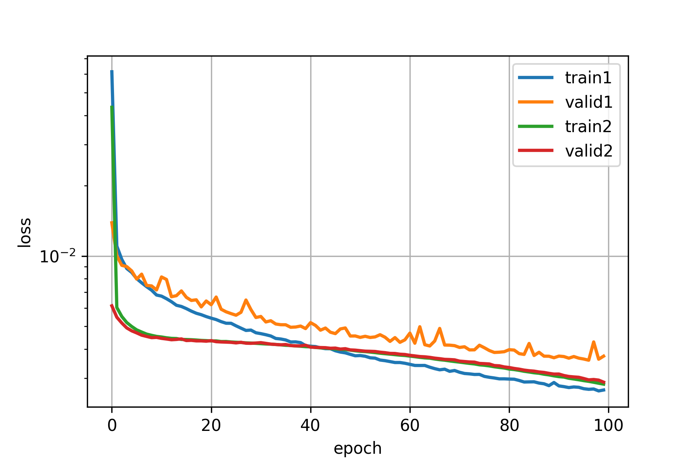
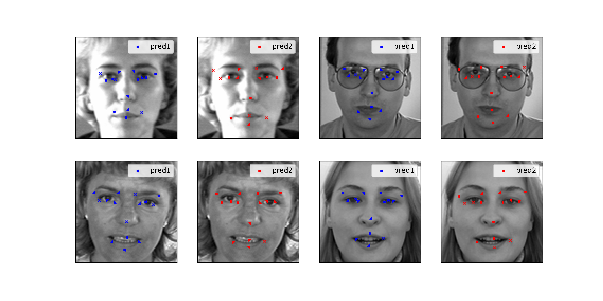

# Kaggle Facial Keypoints Detection with Keras

<!-- TOC -->

- [Kaggle Facial Keypoints Detection with Keras](#kaggle-facial-keypoints-detection-with-keras)
    - [Memo](#memo)
    - [Dataset](#dataset)
    - [Contents](#contents)

<!-- /TOC -->

This is a step by step replica of [Kaggle Facial Keypoints DetectionをKerasで実装する][in1] in Japanese, many thanks to [Shinya Yuki][in2].

[in1]:https://elix-tech.github.io/ja/2016/06/02/kaggle-facial-keypoints-ja.html
[in2]:https://twitter.com/shinyaelix

## Memo

The original [Daniel Nouri's implementation][m1] was built on [Lasagne][m2], a library for an obsolete deep learning framework [Theano][m3].

[m1]:http://danielnouri.org/notes/2014/12/17/using-convolutional-neural-nets-to-detect-facial-keypoints-tutorial/
[m2]:https://github.com/benanne/Lasagne
[m3]:http://deeplearning.net/software/theano/

## Dataset

[Kaggle](https://www.kaggle.com) hosts facial keypoints detection competition and all you need is [here](https://www.kaggle.com/c/facial-keypoints-detection/data)

## Contents

Two neural network models are implemented step by step, a single hidden layer model and a CNN model, and they are named to 1 and 2 in annotation respectively in following histograms.

Loss:

Prediction
