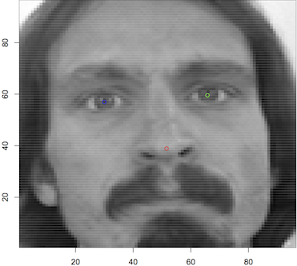

# Kaggle Facial Keypoints Detection with Keras

This is a step by step replica of [This blog in Japanese](https://elix-tech.github.io/ja/2016/06/02/kaggle-facial-keypoints-ja.html), many thanks to Shinya Yuki

## Memo

[The original Daniel Nouri's implementation](http://danielnouri.org/notes/2014/12/17/using-convolutional-neural-nets-to-detect-facial-keypoints-tutorial/) was built on [Lasagne](https://github.com/benanne/Lasagne), a library for the obsolete deep learning framework [Theano](http://deeplearning.net/software/theano/).

## Dataset

[Kaggle](https://www.kaggle.com) holds facial keypoints detection competition and all you need is [here](https://www.kaggle.com/c/facial-keypoints-detection/data)

dataset  | num   | resolution | color     | keypoints
---      | ---   | ---        | ---       | ---
Training | 7049  | 96x96      | grayscale | 15

### Twist of the dataset

Some keypoint have about only 2,000 labels, others have more than 7,000.

An example of one of the faces with three keypoints marked.